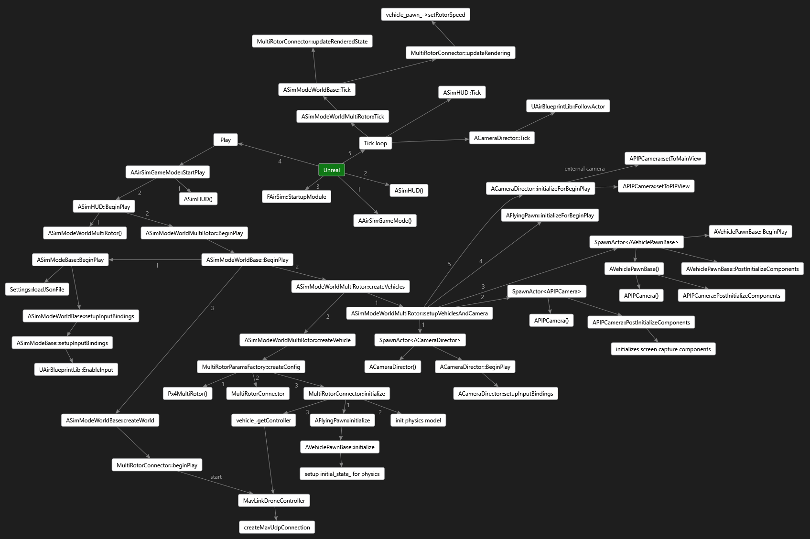

## AirLib

Majority of the code is located in AirLib. This is a self-contained library that you should be able to compile with any C++11 compiler.

AirLib consists of the following components:
1. *Physics engine:* This is header-only physics engine. It is designed to be fast and extensible to implement different vehicles.
2. *Sensor models:* This is header-only models for Barometer, IMU, GPS and Magnetometer
3. *Vehicle models:* This is header-only models for vehicle configurations and models. Currently we have implemented model for a MultiRotor and a configuration for PX4 QuadRotor in the X config.
4. *Control library:* This part of AirLib provides abstract base class for our APIs and concrete implementation for specific vehicle platforms such as MavLink. It also has classes for the RPC client and server.

## Unreal/Plugins/AirSim

This is the only portion of project which is dependent on Unreal engine. We have kept it isolated so we can implement simulator for other platforms as well (for example, Unity). The Unreal code takes advantage of its UObject based classes including Blueprints.
1. *SimMode_ classes*: We wish to support various simulator modes such as pure Computer Vision mode where there is no drone. The SimMode classes help implement many different modes.
2. *VehiclePawnBase*: This is the base class for all vehicle pawn visualizations.
3. *VehicleBase*: This class provides abstract interface to implement a combination of rendering component (i.e. Unreal pawn), physics component (i.e. MultiRotor) and controller (i.e. MavLinkHelper).

## MavLinkCom

This is the library developed by our own team member [Chris Lovett](https://github.com/lovettchris) that provides C++ classes to talk to the MavLink devices. This library is stand alone and can be used in any project.
See [MavLinkCom](../MavLinkCom/README.md) for more info.

## Sample Programs
We have created a few sample programs to demonstrate how to use the API. See HelloDrone and DroneShell. 
DroneShell demonstrates how to connect to the simulator using UDP.  The simulator is running a server (similar to DroneServer).

## Contributing

See [Contibution Guidelines](docs/contributing.md)

## Unreal Framework

The following picture illustrates how AirSim is loaded and invoked by the Unreal Game Engine:

